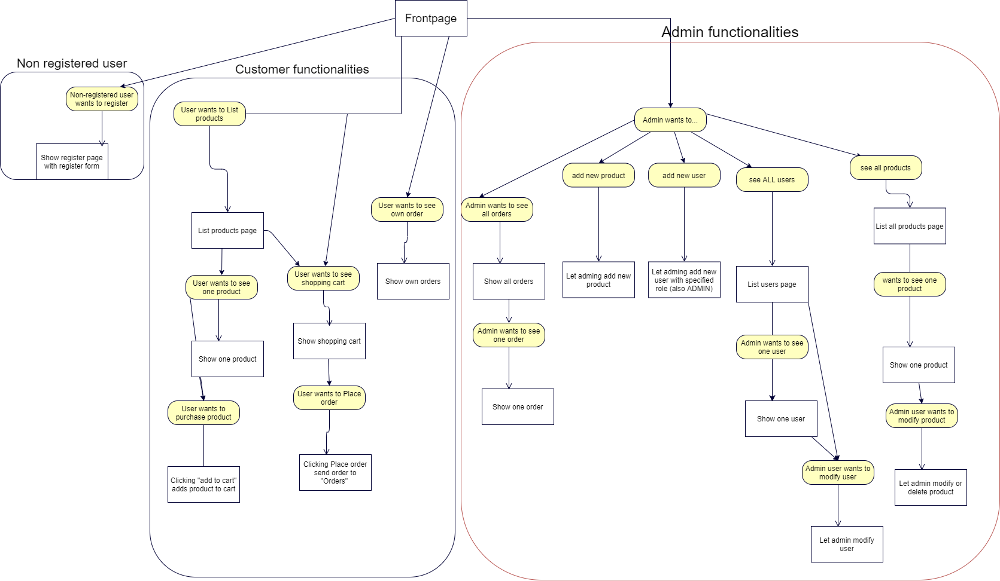

# Group 

Member1:  Joona Pelttari, joonas.pelttari@tuni.fi, 274830
resposible for: Lead developer, complex coding tasks

Member2: Tatu-Pekka Heikkilä, tatu-pekka.heikkila@tuni.fi, 439530
resposible for: Assisting developer


# WebDev1 coursework assignment

A web shop with vanilla HTML, CSS. WebShop version now is in pre Alpha stage. So there are lot of doing.


### The project structure

```
.
├── index.js                --> startup functions to webshop
├── package.json            --> project dependecies and metadata
├── routes.js               --> responsible for routing requests
├── auth                     
│   └──  auth.js            --> user authentication services and funcions
├── controllers              
│   └── users.js            --> controller for user
│   └── orders.js           --> controller for order
│   └── products.js         --> controller for product
├── models                   
│   └── db.js               --> MongoDB connection functions
│   └── order.js            --> MongoDB model for order documents
│   └── product.js          --> MongoDB model for product documents
│   └── user.js             --> MongoDB model for user documents
├── public                  --> all materials that client can achieve 
│   ├── img                 --> images
│   ├── js                  --> different page functions
│   │    ├── adminUsers.js  --> functions for admin in users-page
│   │    ├── cart.js        --> cart functions
│   │    ├── products.js    --> product page functions
│   │    ├── register.js    --> register user function
│   │    └── utils.js       --> utility functions for all pages
│   └── css                 --> stylesheet
├── utils                   
│   ├── render.js           --> rendering functions
│   ├── requestUtils.js     --> request handler functions
│   └── reponseUtils.js     --> response handler functions
└── test                    --> tests
│   ├── auth                --> authentication testers
│   ├── controllers         --> controllers testing
└── └── own                 --> own issues tester

```

## The architecture 



### Pages and navigation
List Orders page is there to show user's own or all users orders depending of user role.

Customer user needs to have "Profile" or similar page to view own orders and change his/her user information.

Admin user needs to have "Admin functionalities" or similar page to:
- view all orders and possibility to drill down into one order
- view all users and possibility to drill down into one user and modify it
- view all products and possibility to drill down into one product and modify it
- add new user with admin rights
- add new product 

### Data models
There are differen MongoDB models for database, order, product and user.

## Tests and documentation

TODO: Links to at least 10 of your group's GitLab issues, and their associated Mocha tests and test files.

- [Show cart items count in UI](https://course-gitlab.tuni.fi/webdev1-2020-2021/webdev1-group-46/-/issues/1)
- [Allow user to change their email](https://course-gitlab.tuni.fi/webdev1-2020-2021/webdev1-group-46/-/issues/2)
-[Allow user to change their name](https://course-gitlab.tuni.fi/webdev1-2020-2021/webdev1-group-46/-/issues/3)
-[Allow user to change their password](https://course-gitlab.tuni.fi/webdev1-2020-2021/webdev1-group-46/-/issues/4)
-[Implement DB connection to products](https://course-gitlab.tuni.fi/webdev1-2020-2021/webdev1-group-46/-/issues/5)
-[Allow user to save their shopping cart](https://course-gitlab.tuni.fi/webdev1-2020-2021/webdev1-group-46/-/issues/6)
-[Show the total price of products in a shopping cart](https://course-gitlab.tuni.fi/webdev1-2020-2021/webdev1-group-46/-/issues/7)
-[Allow user to reset his/her password via email](https://course-gitlab.tuni.fi/webdev1-2020-2021/webdev1-group-46/-/issues/8)
-[Fix ESLint errors](https://course-gitlab.tuni.fi/webdev1-2020-2021/webdev1-group-46/-/issues/9)
-[Simplify routes.js](https://course-gitlab.tuni.fi/webdev1-2020-2021/webdev1-group-46/-/issues/10)
-[Get email-notification when product is available](https://course-gitlab.tuni.fi/webdev1-2020-2021/webdev1-group-46/-/issues11)

## Security concerns

TODO: list the security threats represented in the course slides.
Document how your application protects against the threats.
You are also free to add more security threats + protection here, if you will.

WebShop should prevent all attacks against different types of attacks. Data in registration should be sanitised properly before saving into db to prevent possible attacks.
